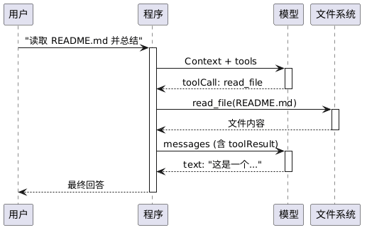

# 开篇：一次完整的 Agent 运行过程

> 在动手写代码之前，让我们先对agent的运行有一个大体的概念 ： 这里用一次 "读取文件并总结" 的请求，看一下怎样走完 Agent 的完整闭环？

## 为什么先观察agent的完整流程？

Coding Agent 涉及四个角色的协作：用户、程序、模型、工具。如果直接开始写代码，写到第三章你会发现自己在问："这条消息是谁发的？为什么要传回去？"

本章先不写代码，我们先跟踪一次完整的执行轨迹，标注好每一步谁在做什么、数据流向哪里，让你大脑中有一个大概的概念。

---

## 场景设定

用户在终端输入：

```
> 读取 README.md 并用一句话总结
```

Agent 会经过以下几个步骤来处理用户的输入：
1. 调用 `read_file` 工具读取文件内容
2. 把文件内容交给模型
3. 模型生成一句话总结返回给用户

看起来简单，但这个过程中程序和模型之间发生了两次 LLM 调用。记下来我们逐步拆解这个过程。

---

## 完整执行轨迹分析

### 第 1 步：用户输入 → 构建消息

用户输入被包装成一条 `user` 消息，加入消息列表：

```
messages = [
  { role: "user", content: "读取 README.md 并用一句话总结" }
]
```

### 第 2 步：第一次调用模型

程序将以下信息打包发送给模型：

```
┌─────────────────────────────────────────────────┐
│ Context (all info the model sees)               │
├─────────────────────────────────────────────────┤
│ systemPrompt: "You are a coding assistant..."   │
│ messages: [user("读取 README.md 并用一句话总结")]  │
│ tools: [read_file, write_file, edit_file, bash] │
└─────────────────────────────────────────────────┘
```

模型看到tools中提供的可用工具列表，决定使用read_file工具先读取文件。模型不直接执行工具，只是返回"想调用什么工具"给程序：

```
← 模型返回：
{
  role: "assistant",
  content: [
    { type: "toolCall", id: "tc_001", name: "read_file", arguments: { path: "README.md" } }
  ],
  stopReason: "tool_use"
}
```

注意这里的 `stopReason: "tool_use"` — 意思是：模型主动停下来，等待工具结果。

### 第 3 步：程序执行工具调用

程序看到 `toolCall`，在本地执行 `read_file({ path: "README.md" })`：

```
→ 读取文件系统
← 得到文件内容："# Mini Pi Coding Agent\n\n一个最小化的..."
```

然后将结果包装成 `toolResult` 消息：

```
{
  role: "toolResult",
  toolCallId: "tc_001",        ← 必须与 toolCall.id 配对
  toolName: "read_file",
  content: [{ type: "text", text: "# Mini Pi Coding Agent\n..." }],
  isError: false
}
```

### 第 4 步：第二次调用模型

程序再次调用模型，这次消息列表多了两条：

```
messages = [
  { role: "user",        content: "读取 README.md 并用一句话总结" },
  { role: "assistant",   content: [toolCall: read_file("README.md")] },
  { role: "toolResult",  content: "# Mini Pi Coding Agent\n..." },
]
```

模型看到文件内容后，生成最终回答：

```
← 模型返回：
{
  role: "assistant",
  content: [
    { type: "text", text: "这是一个用 750 行代码实现的教学用 Coding Agent，展示 Agent Loop 的核心原理。" }
  ],
  stopReason: "end_turn"
}
```

`stopReason: "end_turn"` — 模型认为任务完成，没有更多工具要调用。

### 第 5 步：循环结束，输出给用户

程序检测到没有新的 `toolCall`，退出循环，将文本显示给用户：

```
这是一个用 750 行代码实现的教学用 Coding Agent，展示 Agent Loop 的核心原理。
```

---

## 序列图



---

## 三个结论

### 结论 1：模型不执行任何东西

模型只做一件事：根据当前 Context 生成下一条消息。它不能读文件、不能执行命令、不能上网。所有"动手"的事都由程序完成。

**模型**负责决策和表达。**程序**负责执行和传递。

### 结论 2：程序是一个循环

整个执行流程可以抽象为：

```
while (true) {
  response = callModel(messages)
  if (response 中没有 toolCall) break    ← 任务完成
  for (每个 toolCall) {
    result = execute(toolCall)
    messages.push(result)
  }
}
```

这就是 Agent Loop，第 07 章会完整实现它。

### 结论 3：toolCall 和 toolResult 必须配对

每个 `toolCall.id` 有且只有一个对应的 `toolResult.toolCallId`。

漏掉一个 toolResult，模型下一次调用时会收到不完整的上下文，产生混乱。这是贯穿全教程的不变量。

---

## 术语表

从这次观察中提取后续每章会反复用到的概念：

| 术语 | 含义 | 首次深入 |
|------|------|---------|
| Context | 每次发给模型的完整输入（systemPrompt + messages + tools） | 第 01 章 |
| Message | 对话中的一条消息（user / assistant / toolResult） | 第 03 章 |
| Stream | 模型的流式响应，逐 token 到达 | 第 02 章 |
| Tool | 模型可以"调用"的函数声明（JSON Schema） | 第 06 章 |
| toolCall | 模型返回的"我想调用 X 工具"指令 | 第 06 章 |
| toolResult | 程序执行工具后返回给模型的结果 | 第 06 章 |
| Agent Loop | while 循环：调用模型 → 执行工具 → 重复 | 第 07 章 |
| stopReason | 模型为什么停下来（end_turn / tool_use / error） | 第 07 章 |

---

## 小结

一次 "读取文件并总结" 的 Agent 运行：1 条用户消息触发整个流程，2 次模型调用（第一次决定用工具，第二次给出答案），1 次工具执行（程序在本地读取文件），4 条消息累积（user → assistant(toolCall) → toolResult → assistant(text)）。

程序的全部工作：构建 Context、执行工具、把结果传回去。决策都在模型端发生。

---

## 下一章

现在你看到了 Agent 运行的全貌。下一章开始动手 — 调用一次模型，拿到回复。不需要工具，不需要循环，就是发一句话，等一个回答。30 行代码的事。

→ [第 01 章：Hello LLM — 30 行代码调用大模型](./01-hello-llm.md)
